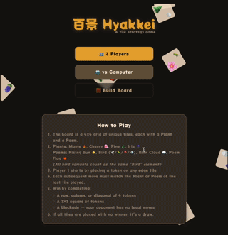

# Hyakkei

> **A strategic tile game inspired by [Niya/Okiya](https://boardgamegeek.com/boardgame/125311/okiya).**
>
> _Original game design by Bruno Cathala, Art by Cyril Bouquet._

<div align="center">

[](https://andhw.github.io/hyakkei/)

[](https://andhw.github.io/hyakkei/)
</div>

## The Project

**Hyakkei** is a modern web implementation and high-performance solver for the classic tile strategy game. It features a React-based web interface and a C-accelerated Python backend capable of exhaustively analyzing the game's massive state space.

The goal is twofold:

1. **A polished, playable web version** of the game.
2. **A "perfect play" solver** that explores the full game tree to derive actionable heuristics for human players.

## The Game Rules

1. **Grid:** 4×4.
2. **Components:** 16 tiles. Each tile has a Plant (Maple, Cherry, Pine, Iris) and a Poem (Sun, Bird, Rain, Flag).
3. **Setup:** The 16 tiles are randomly arranged on the grid at the start.
4. **Movement:**
   - Player 1 _must_ choose a tile on the periphery (edge) for the first move.
   - Subsequent moves must match the Plant OR Poem of the previous tile.
5. **Win Conditions:**
   - Create a line of 4 (Horizontal, Vertical, Diagonal).
   - Create a 2×2 Square.
   - **Blockade:** If the opponent has no legal moves, the current player wins.

## How the Solver Works

### The State Space Problem

There are **16! ≈ 20.9 trillion** possible board arrangements. Solving every one via minimax is infeasible — but most boards are equivalent under symmetry.

### Equivalence Canonicalization

Two boards are **equivalent** if one can be obtained from the other by:

- **Spatial symmetry** — 4 rotations × 2 reflections = **8** transforms
- **Label permutation** — renaming the 4 plant labels (4! = 24) and/or the 4 poem labels (4! = 24) = **576** relabelings
- **Plant↔Poem swap** — swapping what counts as "plant" vs "poem" = **×2**

**Total equivalence group: 8 × 576 × 2 = 9,216**.

This reduces the search space from ~20.9 trillion raw permutations to **~2.3 billion unique equivalence classes**. Every board the solver processes represents 9,216 raw permutations.

### Architecture

| Layer            | Technology            | Purpose                                                                                                         |
| ---------------- | --------------------- | --------------------------------------------------------------------------------------------------------------- |
| **Core solver**  | C (`solver_core.c`)   | Minimax with alpha-beta pruning, transposition table, and board canonicalization — compiled as a shared library |
| **Orchestrator** | Python (`main.py`)    | Random sampling, parallelization via `ProcessPoolExecutor`, progress tracking                                   |
| **Storage**      | SQLite (`niya.db`)    | Persists solved boards for analysis and resume capability                                                       |
| **Analysis**     | Python (`analyze.py`) | 11 heuristic queries against solved data (see [HEURISTICS.md](HEURISTICS.md))                                   |
| **Web UI**       | React (TypeScript)    | Playable game interface in `web/`                                                                               |

### Performance

| Metric                    | Value                                                       |
| ------------------------- | ----------------------------------------------------------- |
| Single-process solve rate | ~66 canonical boards/sec                                    |
| 8-worker solve rate       | ~400–500 canonical boards/sec                               |
| Effective coverage rate   | ~608,000 permutations/sec (each board × 9,216 equivalences) |

## Setup

1. **Clone and enter the repository:**

   ```bash
   git clone <repository-url>
   cd niya_solver
   ```

2. **Create a Python virtual environment:**

   ```bash
   python3 -m venv venv
   source venv/bin/activate
   ```

3. **Install dependencies:**

   ```bash
   pip install -r requirements.txt
   ```

4. **Compile the C solver:**

   ```bash
   cc -O3 -shared -o src/solver_core.so src/solver_core.c
   ```

   > If the `.so` is missing, the solver falls back to a pure Python implementation (~50× slower).

## Running the Solver

```bash
python src/main.py                  # Full solve (P1 + P2 analysis)
python src/main.py --skip-p2        # P1 only (faster, less data)
python src/main.py --workers 4      # Control CPU usage
python src/main.py --target 10000   # Solve 10k boards then stop (shows ETA)
```

The solver is **pausable and resumable** — stop with `Ctrl+C`, restart and it picks up where it left off.

## Extracting Winning Heuristics

The primary goal of this project is to not just solve the game, but to provide actionable insights for human players. Once the solver has populated the `niya.db` database with a significant number of solved board states, you can analyze the data to discover winning patterns.

Check out our deep dive into **[P2 Dominant Strategies](P2_DOMINANCE.md)**.

You can use SQL queries on the `solutions` table to ask questions like:

## Analyzing Results

Once the solver has populated `data/niya.db`, run the heuristic analysis:

```bash
python analyze.py              # Run all 11 queries
python analyze.py -q 1         # Run a specific query
python analyze.py --list       # List available queries
```

See [HEURISTICS.md](HEURISTICS.md) for the full list of analytical questions.

## Debugging a Specific Board

```bash
python debug_board.py          # Solve a single board with verbose minimax output
```

## Project Structure

```txt
├── src/
│   ├── solver_core.c      # C minimax solver + canonicalization (compiled to .so)
│   ├── solver.py           # Python wrapper — loads C solver via ctypes
│   ├── main.py             # Batch solver with multiprocessing
│   ├── models.py           # Data models (Board, SolveResult, Outcome, etc.)
│   ├── utils.py            # Board generation, canonicalization, visualization
│   └── database.py         # SQLite persistence layer
├── web/                    # React web interface
├── analyze.py              # Heuristic analysis queries
├── debug_board.py          # Single-board debug tool
├── HEURISTICS.md           # Analysis query reference
└── README.md
```
